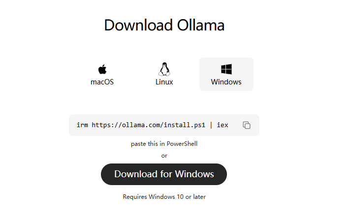

# 在本地部署LLM模型 并接入ASR模型实现外部语音接口与LLM对话聊天

## 一、 下载OLLAMA



或者直接用我网盘里面的链接：

ollama：v0.17.4

[https://pan.baidu.com/s/1-F1q6YK7voii3pw84LPuRQ?pwd=xy6x](https://pan.baidu.com/s/1-F1q6YK7voii3pw84LPuRQ?pwd=xy6x)

### 1.1 下载安装qwen模型

在powershell运行：

```python
ollama run qwen3:4b
```


安装完成后输入一句话 测试一下：


## 二、配置安装Qwen3-ASR模型

参考文档：

[https://modelscope.cn/models/Qwen/Qwen3-ASR-1.7B](https://modelscope.cn/models/Qwen/Qwen3-ASR-1.7B)

百度网盘下载到本地模型权重：

[https://pan.baidu.com/s/1wKI6Bm74LSyXX-DhSXeG5Q?pwd=rnr3](https://pan.baidu.com/s/1wKI6Bm74LSyXX-DhSXeG5Q?pwd=rnr3)

## 2.1 配置qwen3-asr模型运行环境

## 配置Qwen3 ASR 环境

`conda create -n qwen3-asr python=3.12 -y`

`conda activate qwen3-asr`

## 这边选择使用vLLM 推理 以获得更快的推理速度和流式支持

`pip install -U qwen-asr[vllm]`

安装完后可以尝试一下是否可以运行ASR模型 ：

```jsx
python ./test.py
```

## 三、配置安装Qwen3-TTS模型

参考文档：[https://modelscope.cn/studios/Qwen/Qwen3-TTS](https://modelscope.cn/studios/Qwen/Qwen3-TTS)

模型网盘链接：[https://pan.baidu.com/s/1-WBnqH1Ycw2pPeE5NTsXKQ?pwd=w6c5](https://pan.baidu.com/s/1-WBnqH1Ycw2pPeE5NTsXKQ?pwd=w6c5)

本项目使用到的模型为：Qwen3-TTS-12Hz-0.6B-CustomVoice

### 3.1 配置运行环境

```jsx
conda activate qwen3-asr
pip install -U qwen-tts
```

### 3.2 测试TTS模型

测试模型是否可以正常加载并运行

可以直接运行 ：

```jsx
python test_tts.py
```

### 3.3 报错 Sox not found

如果报错 Sox not found 则需要下载安装一下 ，下面提供百度网盘下载链接：

通过网盘分享的文件：sox-14.4.2-win32.exe
链接: [https://pan.baidu.com/s/1d_M_ozJ45Kl9D-76EnNlYQ?pwd=ubab](https://pan.baidu.com/s/1d_M_ozJ45Kl9D-76EnNlYQ?pwd=ubab) 提取码: ubab
安装完成以后需要配置一下 环境变量 ：

在系统环境变量 Path中添加 刚刚 Sox的安装路径：


检查 sox是否成功 需要在powershell 输入 sox —version 检查


## 四、配置安装Rust编译环境

从：[https://rust-lang.org/tools/install/](https://rust-lang.org/tools/install/) 网站下载rust-init 并安装编译环境 

安装完成后 输入 cargo -h        rustc -h 检查是否可以正常 使用


## 五、外部设备

买一块免驱麦克风：


接入外部音频

## 六、git clone 源码 编译运行

[GitHub - Xldln/llm_asr_chat_base_qwen: The workflow involves utilizing Qwen3's ASR for speech-to-text conversion of external audio inputs. The resulting text is then integrated into an Ollama-managed Qwen3 model for chat output.](https://github.com/Xldln/llm_asr_chat_base_qwen)

```python
cd lam_qwen3

## 先启动fastapi 运行 TTS 推理服务和 ASR 推理服务

python app/main.py

##等待启动成功 

## 另外开个终端 运行 rust项目

cargo run 

## 以上命令可以直接编译运行 rust项目 

```

成功如下：

**FastApi:**


**Rust：**

